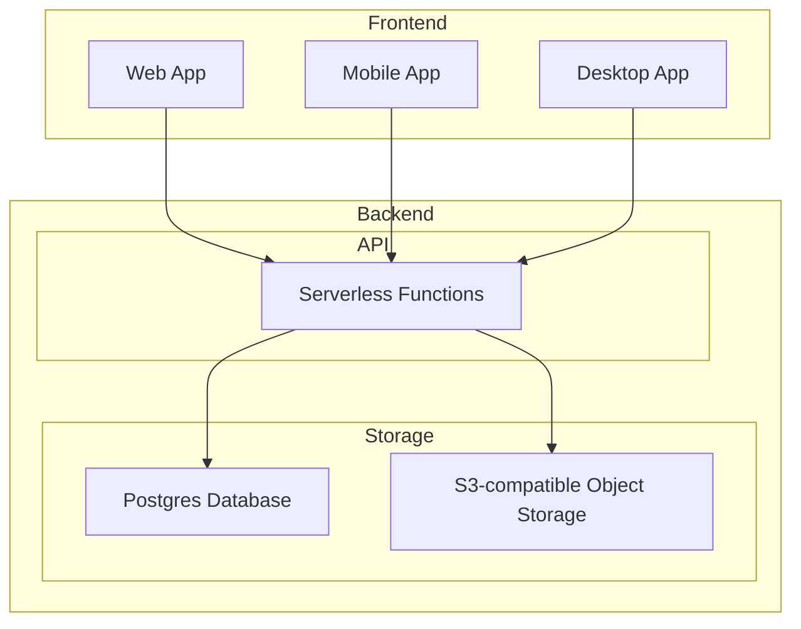

# Health Protocol App Architecture

## Proposed Architecture
The key components of the proposed architecture are:

1. Cloud graph database (e.g. Memgraph, Neo4j) for storing core data 
2. Cloud storage (e.g. Supabase, Firebase, S3) for media assets
3. Content management server and API running on cloud VM (EC2)
4. Content and database management web app on cloud VM (EC2)  
5. Public web app for browsing and adding protocols/activities
6. Mobile and desktop apps wrapping web app via Tauri

Pros:
- Separates concerns between structured data and media assets
- Leverages managed services to reduce ops burden
- Graph DB is well-suited for highly connected protocol/activity data
- Cross-platform apps provide offline access

Cons: 
- Multiple cloud providers increases complexity
- Potential vendor lock-in with specific cloud services
- Running own VMs requires more maintenance vs fully managed
- Separate content management app adds development overhead

## Alternative Considerations

To optimize for maintainability, cost, and portability:

1. Use a unified backend stack, either:
   - Managed backend (Firebase, Supabase, AWS Amplify, etc)
   - Self-hosted (PostgreSQL, S3-compatible object storage, REST API) 
2. Serverless API instead of VMs for lower cost and less ops
3. Combine content and data management into main web app
4. Use open source DB (Postgres) vs proprietary (Neo4j) for portability
5. Consider PWA instead of Tauri apps for better web integration

## Recommended Architecture

Key points:
- Unified backend with Postgres and S3-compatible object storage 
- Serverless API using cloud functions (e.g. Lambda, Cloud Functions)
- Progressive web app (PWA) for offline-capable web experience
- Mobile/desktop apps use same API and can sync data for offline use
- Self-hosted or managed backend options for flexibility

This architecture balances maintainability, cost-efficiency, and portability while still meeting the core functional requirements. The progressive web app approach combined with backend flexibility gives a path to avoid lock-in while leveraging cloud platforms.

Next steps would be to prototype core workflows on proposed stack to validate the design. Managed backends like Firebase could accelerate early development while keeping a transition path to fully self-hosted.
